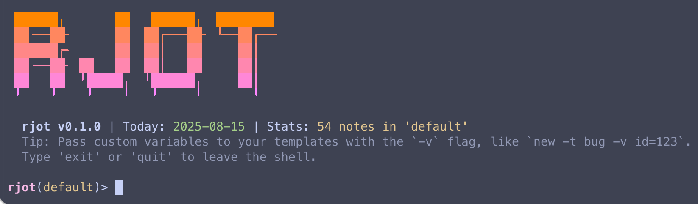

# rjot 

---

<p align="left">
  
</p>

A minimalist, command-line jotting utility that's fast, private, git-friendly, and written in Rust.

[](https://github.com/bgreenwell/rjot/actions/workflows/rust.yml)
[](https://github.com/bgreenwell/rjot/actions/workflows/release.yml)
[](https://github.com/bgreenwell/rjot/actions/workflows/rust.yml)
[](https://codecov.io/gh/bgreenwell/rjot)

[](https://crates.io/crates/rjot)
[](https://crates.io/crates/rjot)
[](https://docs.rs/rjot)
[](https://github.com/bgreenwell/rjot/releases)

[](https://opensource.org/licenses/MIT)
[](https://www.rust-lang.org)
[](https://github.com/bgreenwell/rjot#installation)

## The vision

`rjot` is a tool for capturing thoughts at the speed of typing. It's built on a few core principles:

  * **CLI-first, not CLI-only**: The terminal is the most powerful and frictionless interface for capturing text. `rjot` is designed to be a first-class citizen of your command line.
  * **Plain text is sacred**: Your data is just a folder of Markdown files. It will always be readable, editable, and portable with or without `rjot`. No proprietary formats, no databases, no lock-in.
  * **You own your data**: `rjot` will never push you to a proprietary sync service. It's designed from the ground up to empower you with control over your own data.

This project aims to be the perfect, minimalist companion for developers, writers, and anyone who lives in the terminal.

## Features

  * **Instant capture**: Jot down a thought instantly from the command line.
  * **Multiple notebooks**: Organize your jots into separate collections (e.g., `work`, `personal`, `project-x`).
  * **Task management**: Quickly create tasks and view all pending items across a notebook.
  * **Editor integration**: Use `rjot new` to open your favorite editor (`$EDITOR`) for longer-form entries with template support.
  * **Pinning jots**: Mark essential notes with `rjot pin` to keep them readily accessible with `rjot list --pinned`.
  * **Powerful search & filtering**: Full-text search, tag-based filtering, and time-based views (`today`, `week`, `on <date>`, or `on <date-from>...<date-to>`).
  * **Note management**: Easily `show`, `edit`, `tag`, or `delete` any note using a unique ID prefix or its recency (`--last` or `--last=3`).
  * **Standard & configurable**: Follows platform-specific conventions for data storage and respects standard environment variables.

## Installation

**Note:** Once this project gains stable releases, you will be able to install it via your system's package manager (e.g., `apt`, `brew`, etc.). Until then, you can use the methods below.

### From crates.io (recommended)

This method automatically downloads, compiles, and installs `rjot` on your system.

1.  **Install the Rust toolchain**

    If you don't already have it, install Rust from the official site: [rustup.rs](https://rustup.rs/).

2.  **Install `rjot`**

    ```sh
    cargo install rjot
    ```

    This will place the `rjot` executable in your cargo binary path (usually `~/.cargo/bin/`), making it available from anywhere in your terminal.

### From source

To build the very latest version directly from the source code:

```sh
git clone https://github.com/bgreenwell/rjot.git
cd rjot
cargo install --path .
```

-----

## Usage guide

### A note on shells and quotes

Your command-line shell (like Bash or Zsh) can interpret special characters like `!` or expand variables like `$USER` inside double quotes (`"`). This can cause unexpected behavior.

**The best practice is to always use single quotes (`'`) for your messages.** This tells the shell to treat every character literally.

```sh
# GOOD: This works perfectly.
❯ rjot 'This is a great idea!'

# BAD: This will probably fail!
❯ rjot "This is a great idea!"
```

### Creating notes

By default, all jots are created in your active notebook (which is `default` until you change it).

**1. Jot down a quick note (the default action):**

```sh
❯ rjot 'This is a quick thought I want to save.'
```

**2. Create a tagged, one-liner note:**
The `--tags` (or `-t`) flag accepts space-separated or comma-separated values.

```sh
❯ rjot 'A great idea for the project' --tags project rust
```

**3. Create a longer note in your editor:**

```sh
# This opens your default $EDITOR
❯ rjot new

# Use a custom template for structured notes
❯ rjot new --template meeting.md
```

### Advanced templating

`rjot`'s templating system can be used to create structured notes with pre-filled, context-aware information.

#### Built-in variables

You can use the following variables in any template file:

  * `{{date}}`: The current date and time in RFC 3339 format.
  * `{{uuid}}`: A unique identifier (v4 UUID) for the note.
  * `{{project_dir}}`: The name of the current directory.
  * `{{branch}}`: The current git branch name.

**Example `bug.md` template:**

```markdown
---
tags:
  - bug
  - {{project_dir}}
---

# Bug Report: {{uuid}}

- **Branch**: {{branch}}
- **Date**: {{date}}

## Description

(describe the bug)
```

#### Creating a new template

Creating your own template is how you can customize `rjot` for your specific workflow. Here’s how:

1.  **Find your templates directory.** Run `rjot info --paths` to find the location of your `rjot` root directory. Your templates are stored in the `templates/` subdirectory.

2.  **Create a new file.** Create a new Markdown file in the `templates` directory. The name of the file (without the `.md` extension) is the name of your template. For example, `daily-journal.md` becomes the `daily-journal` template.

3.  **Add your content.** Open the file and add your desired content, using any of the built-in or custom variables.

Once the file is saved, you can use it immediately with the `rjot new --template <template-name>` command.

#### Custom variables

You can also define your own variables from the command line using the `-v` or `--variable` flag.

**Example `dev-journal.md` template:**

```markdown
---
tags:
  - journal
  - {{project_dir}}
  - {{feature_name}}
---
# Dev Journal: {{uuid}}

- **Ticket**: [{{ticket_id}}](https://jira.example.com/browse/{{ticket_id}})
- **Branch**: {{branch}}
- **Date**: {{date}}

## Progress

(What did I accomplish today?)
```

**Command:**

```sh
rjot new \
  --template dev-journal \
  -v feature_name=user-profile \
  -v ticket_id=PROJ-123
```

### Using the interactive shell

For a more immersive experience, `rjot` provides a stateful interactive shell. This is a great way to perform many actions without having to type `rjot` each time.

**1. Launch the shell:**

```sh
❯ rjot shell

 ██████╗       ██╗  ██████╗  ████████╗
 ██╔══██╗      ██║ ██╔═══██╗ ╚══██╔══╝
 ██████╔╝      ██║ ██║   ██║    ██║   
 ██╔══██╗ ██   ██║ ██║   ██║    ██║   
 ██║  ██║ ╚█████╔╝ ╚██████╔╝    ██║   
 ╚═╝  ╚═╝  ╚════╝   ╚═════╝     ╚═╝   

  rjot v0.1.0 | Today: 2025-07-20 | Stats: 53 notes in 'default'
  Tip: Find your templates folder and other important paths with `info --paths`.
  Type 'exit' or 'quit' to leave the shell.

rjot(default)>
````

**2. Interact with `rjot`:**
Once inside, you can use all the standard `rjot` commands.

```sh
rjot(default)> list 5
rjot(default)> task 'My new task from the shell'
```

**3. Switch notebooks without `eval`:**
The shell manages the active notebook internally.

```sh
rjot(default)> use project-icarus
Active notebook switched to 'project-icarus'.
rjot(project-icarus)>
```

**4. Autocompletion and history:**
Press `Tab` to autocomplete commands or notebook names. Use the up and down arrow keys to navigate your command history.

### Working with notebooks

`rjot` allows you to organize your notes into separate notebooks. All commands operate on the currently active notebook.

**1. Create a new notebook:**

```sh
❯ rjot notebook new project-icarus
Successfully created new notebook: 'project-icarus'
```

**2. List all available notebooks:**
An asterisk (`*`) indicates the currently active notebook.

```sh
❯ rjot notebook list
Available notebooks (* indicates active):
  * default
  project-icarus
```

**3. Switch your active notebook:**
Because a program can't change its parent shell's environment, you must use `eval` to make the change take effect for your current terminal session.

```sh
❯ eval $(rjot notebook use project-icarus)

# To check which notebook is active
❯ rjot notebook status
Active notebook: project-icarus
```

**4. Jot in a different notebook without switching:**
You can use the global `--notebook` flag to perform a single action in another notebook.

```sh
# Even if 'project-icarus' is active, this goes to 'personal'
❯ rjot 'Remember to buy milk' --notebook personal
```

### Viewing and filtering notes

All viewing and filtering commands are scoped to the active notebook unless otherwise specified.

**1. List a specific number of recent notes:**
The `list` command defaults to showing 10 notes, but you can provide a number to see more or less.

```sh
❯ rjot list
❯ rjot list 5
````

**2. Full-text search:**
You can search within the active notebook or use the `--all` flag to search across every notebook.

```sh
# Search for 'productivity' in the active notebook
❯ rjot find 'productivity'

# Search for 'database' across ALL notebooks
❯ rjot find 'database' --all
```

**3. Filter by one or more tags:**

```sh
# Find notes with BOTH 'rust' and 'cli' tags in the active notebook
❯ rjot tags rust,cli
```

**4. View notes from a specific time:**

```sh
❯ rjot today
❯ rjot week
❯ rjot on 2025-05-01..2025-05-31
```

**5. Compile notes into a summary:**
Add the `--compile` flag to any time-based view to get a single Markdown summary.

```sh
❯ rjot week --compile > weekly-summary.md
```

### Managing specific notes

These commands target a specific note within the active notebook.

**1. Show the full content of a note:**

```sh
# By ID prefix
❯ rjot show 2025-06-08-1345

# By recency (the most recent note)
❯ rjot show --last
```

**2. Edit a note:**

```sh
# Edit the 3rd most recent note
❯ rjot edit --last=3
```

**3. Delete a note:**
This command will ask for confirmation unless you use the `--force` flag.

```sh
# Delete a note by ID prefix, with a confirmation prompt
❯ rjot delete 2025-06-08-1345
```

### Managing tasks

Many jots are simple to-do lists. `rjot` provides a quick way to create tasks and get a high-level overview of all pending items.

**1. Create a task:**
Use the `task` subcommand (or its aliases `todo` and `t`) to quickly create a new jot formatted as a Markdown task.

```sh
❯ rjot task 'Set up the new database schema'
❯ rjot todo 'Write unit tests for the auth service'
```

This creates a new note with the content `- [ ] Set up the new database schema`.

**2. View all incomplete tasks:**
Use the `--tasks` flag with the `list` command to see a list of all jots that contain one or more pending tasks.

```sh
❯ rjot list --tasks
```

### Pinning and unpinning notes/jots

Pinning is a great way to keep important notes from getting buried in your timeline.

**1. Pin a note:**
You can target a note by its ID or by its recency.

```sh
# Pin a specific jot
❯ rjot pin 2025-07-09-105000

# Pin the last jot you created
❯ rjot pin --last
```

**2. View all pinned notes:**
Use the `--pinned` flag with the `list` command.

```sh
❯ rjot list --pinned
```

**3. Unpin a note:**
When a note is no longer critical, you can unpin it.

```sh
❯ rjot unpin 2025-07-09-105000
```

### Managing tags

Use the `tag` subcommand to modify tags on an existing note in the active notebook.

**1. Add tags to a note:**

```sh
# Add 'rust' and 'idea' to the last jot
❯ rjot tag add --last=1 rust,idea
```

**2. Remove tags from a note:**

```sh
# Remove the 'idea' tag from a specific jot
❯ rjot tag rm -p 2025-06-09 idea
```

**3. Overwrite all tags on a note:**

```sh
# Replace all tags on the 2nd to last jot with 'archived'
❯ rjot tag set --last=2 archived
```

### Importing and exporting notebooks

`rjot` allows you to export entire notebooks for backups, sharing, or migration. You can import these notebooks on another machine or into another `rjot` instance.

**1. Export a notebook:**

You can export to a `.zip` archive or a consolidated `.json` file.

```sh
# Export the 'work' notebook into a zip file
rjot export work --output ./work_backup.zip

# Export the 'personal' notebook into a JSON file
rjot export personal --format json --output ./personal_backup.json
```

**2. Import a notebook:**

`rjot` will automatically detect the file type and create a new notebook.

```bash
# Import from a zip file. This will create a new notebook named 'work_backup'.
rjot import ./work_backup.zip

# Import from a json file. This will create a new notebook named 'personal'.
rjot import ./personal_backup.json
```

### Utility commands

Get info about your setup:

```sh
# Show storage paths and the active notebook
❯ rjot info --paths

# Show note, tag, and task statistics for the active notebook
❯ rjot info --stats

# Show combined stats for ALL notebooks
❯ rjot info --stats --all
```

### Git integration (optional)

`rjot` offers a convenient, built-in way to version control your notes. The git repository is initialized at the `rjot` root, meaning a single repo tracks all of your notebooks.

#### One-time setup

1.  **Initialize `rjot` with Git:**

    ```sh
    ❯ rjot init --git
    ```

2.  **Create a private remote repository:**
    Go to GitHub (or another Git provider) and create a new, empty **private** repository.

3.  **Link the remote:**
    Navigate into your `rjot` directory (`rjot info --paths` will show you where) and add the remote.

    ```sh
    # Example for GitHub over SSH
    ❯ git remote add origin git@github.com:YOUR_USERNAME/my-journal.git
    ```

#### The `sync` command

Once set up, `rjot sync` will automatically stage, commit, and push changes from all notebooks.

```sh
❯ rjot sync
```

### Encryption (optional)

For maximum privacy, you can enable transparent, on-disk encryption for all notebooks. The encryption keys are stored globally in your `rjot` root directory.

**One-time setup:**

```sh
❯ rjot init --encrypt
```

**IMPORTANT:** You must back up the `identity.txt` file somewhere safe. If you lose it, your notes cannot be recovered.

**Turning off encryption:**
The `decrypt` command will permanently decrypt all notes in all notebooks.

```sh
❯ rjot decrypt
```

## Configuration

### File storage location

`rjot` respects platform conventions and the `$RJOT_DIR` environment variable for all its data. By default, your journal is stored in the following locations:

* **macOS:** `~/Users/<YourUsername>/Library/Application Support/rjot/`
* **Linux:** `~/.config/rjot/`
* **Windows:** `C:\Users\<YourUsername>\AppData\Roaming\rjot\`

Within that root directory, your notes are organized in the `notebooks/` subdirectory.

### Templates

You can create custom templates for new notes by placing Markdown files in the `templates/` subdirectory inside your `rjot` root folder (e.g., `~/.config/rjot/templates/`). `rjot` supports one variable, `{{date}}`, which will be replaced with the current timestamp when the note is created. The templating system supports several built-in variables (like `{{branch}}` and `{{uuid}}`) and allows for custom variables to be passed from the command line. For a detailed guide on how to use these advanced features, please see the "Advanced templating" section in the usage guide above.

## Contributing

This project is open source and contributions are welcome\! Please feel free to open an issue or submit a pull request.

## License

This project is licensed under the **MIT License**.